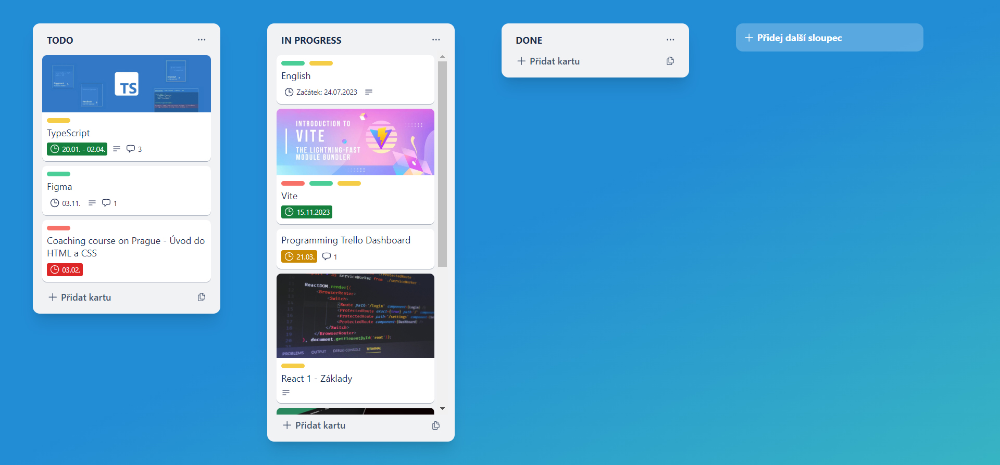

# Trello Dashboard React App

Cílem tohoto projektu je prohloubit znalosti Reactu a napojit data na Supabase.

**Na tomto projektu aktuálně pracuju.**

>- programuju v **Reactu**
>- styluju pomocí **Tailwind CSS**
>- využívám bundler **Vite**
>- data ukládám (v současnosti) do **localStorage**

## Aktuálně aplikace umožňuje:

### Práce se sloupci
- **přidat** nový sloupec, **duplikovat** sloupec, **změnit název** sloupce

### Práce s kartami
- **přidat** novou kartu, přetáhnout (drag and drop) kartu do jiného sloupce
- **označit úkol jako dokončený** kliknutím na ikonu datumu
- **zobrazovat ikony**, pokud má karta:
    - vyplněný popis
    - obsahuje komentáře vč. jejich počtu
    - barevně odlišovat termín (červeně - po termínu, žlutě - dnešní termín, zeleně - hotovo, bez barvy - pozdější termín)
    - štítky

### Detail karty
- **upravit název** karty
- **přidat nebo upravit popis** karty
- **přidat, upravit nebo smazat komentáře** (chronologicky seřazeny)
- **přidat, upravit nebo smazat termín** (datum zahájení a termín dokončení)

Na dalších funcionalitách aplikace pracuju.

